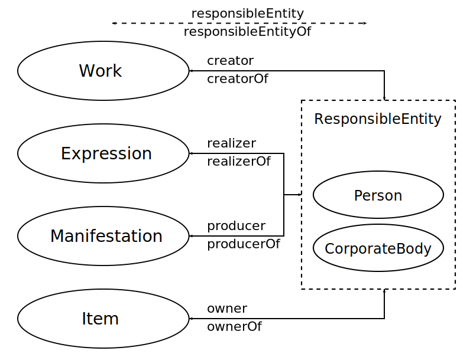

# Kurze FRBR Einführung

FRBR steht für **F**unctional **R**equirements for **B**ibliographic **R**ecords und bezeichnet ein Datenmodell für bibliographische Metadaten. Das Konzept von FRBR beruht auf dem Eintity-Relationship-Modell, d.h. das Grundprinzip ist die Beschreibung von sogenannten „Entitäten“ und ihrer Beziehungen („Relationship“).

## Entitäten

FRBR definiert Entitäten in drei Gruppen. Im Kontext diese Kurses beschäftigen wir uns grundständig mit den Entitäten-Typen der *Gruppe 1*: work, expression, manifestation und item. Die Entitäten der *Gruppe 2* (person, corporate body) und *Gruppe 3* (concept, object, event, place) sind nur von periphärem Interesse.

## Beziehungen von Entitäten

Die Beziehungen der *Gruppe 1 Entitäten* soll an folgender Abbildung verdeutlicht werden.

Abb. 1: FRBR Gruppe 1 Entitäten und ihre Beziehungen
Voss, Jakob: Basic Group 1 entities and relations of the FRBR model (RDF version), https://commons.wikimedia.org/wiki/File:FRBR-Group-1-entities-and-basic-relations.svg#/media/File:FRBR-Group-1-entities-and-basic-relations.svg,CC BY-SA 4.0, erstellt: 17. Dezember 2007, abgerufen: 29. August 2019

Abb. 2: Beziehungen der FRBR Gruppe 1 und Gruppe 2 Entitäten
Voss, Jakob: Basic Group 2 entities and relations of the FRBR model (RDF version), https://de.wikipedia.org/wiki/Functional_Requirements_for_Bibliographic_Records#/media/Datei:FRBR-Group-2-entities-and-relations.svg, Jakob, CC BY-SA 4.0, erstellt: 17. Dezember 2007, abgerufen: 29. August 2019

# MEI und FRBR

In MEI v2013 wurde das FRBR-Konzept erstmals umgesetzt, um eine den bibliothekarischen Standards entgegenkommende Beschreibung von Objekten zu ermöglichen.

Mit der aktuellen MEI v4 (erstmals veröffentlicht 2018) wurde eine striktere Ausrichtung von MEI an den Konzepten und Begriffen von FRBR vorgenommen.